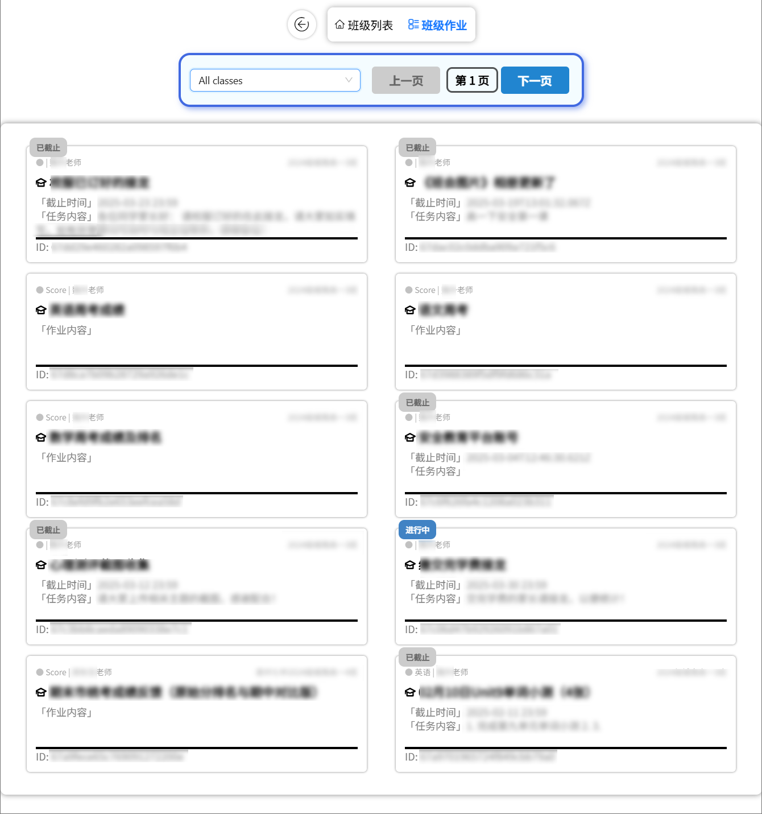
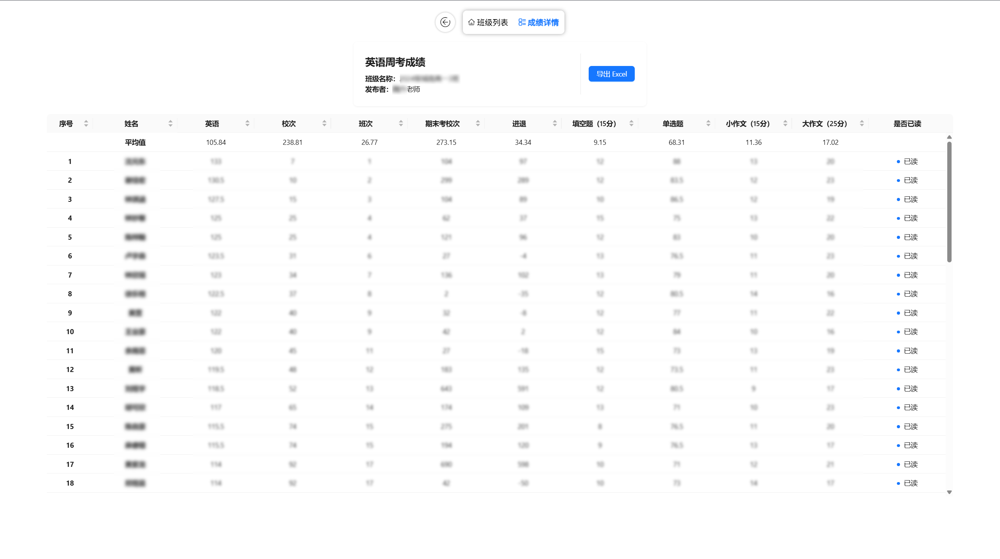
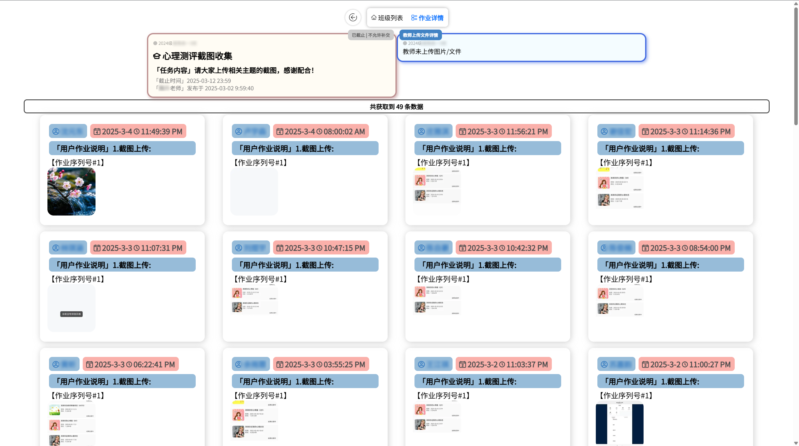

# BJXGJ Helper  

## ⚠ 注意事项  
本项目仅供学习和技术交流使用，**严禁**将其用于任何违法、违规或可能侵犯他人合法权益的用途。用户在使用本项目时，应严格遵守适用的法律法规、行业规定及道德准则，确保其行为符合相关政策和法律要求。  

本项目的开发者及贡献者**不对**任何因使用本项目而产生的直接或间接后果承担责任。使用本项目即表示用户**完全理解并接受**所有可能的风险，且愿意自行承担一切法律责任及后果。  

如因使用本项目而导致任何争议、损失或法律责任，均由用户自行承担，开发者和贡献者不承担任何责任，请务必在**合规、合法**的前提下使用本项目，共同维护健康、安全的技术交流环境。

## 📦 环境搭建  

1. 克隆或下载本项目，并进入项目目录：  
   ```sh
   cd bjxgjHelper
   ```  
2. 安装依赖：  
   ```sh
   npm install
   ```  
3. 配置配置数据文件：  
   - 在 `public/api/classListByCode.json` 中添加必要的配置信息，也可通过修改代码配置 src\components\ClassList 组件中的 `classList` 数据。

## 🚀 启动开发环境  

1. 运行后端服务：  
   ```sh
   python main.py
   ```  
2. 启动前端：  
   ```sh
   npm run dev
   ```  
3. 在浏览器中打开： [http://localhost:2233](http://localhost:2233)  
   - 默认端口号 **2233**，可在 `vite.config.ts` 文件中修改。
4. 进入网站的默认 root 授权码：
   - root20252025
   - #root~@bjxgjHelper

## 📦 代码打包  

执行以下命令进行打包：  
```sh
npm run build
```  
- 打包后的代码将自动生成在项目根目录的 `disk` 文件夹中。  

## 🖼 网站界面预览  

### 📌 作业列表  
  

### 📊 成绩页面  
  

### 📄 作业详情  
  